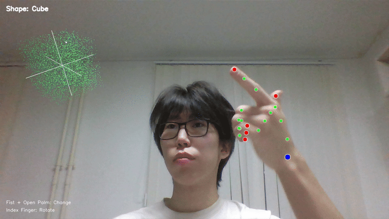

# AR Gesture Control

Интерактивное AR приложение для управления 3D объектами с помощью жестов руки в режиме реального времени.

## Демо



## Описание

Приложение использует компьютерное зрение для распознавания жестов руки и отображает интерактивные 3D объекты из частиц. Управляйте объектами без касания - только движениями рук!

### Возможности:
- 6 различных 3D форм (куб, сфера, тор, пирамида, цилиндр, спираль)
- Управление жестами руки
- Система частиц с эффектом глубины
- Полноэкранный AR режим
- Плавные анимации и переходы

## Требования

### Python версия
- **Рекомендуется: Python 3.11**
- Поддерживается: Python 3.8 - 3.11

> **Важно!** Если возникают ошибки при установке или запуске, используйте **Python 3.11**. Некоторые библиотеки (особенно OpenGL и MediaPipe) могут иметь проблемы совместимости с другими версиями.

### Необходимые библиотеки
```
opencv-python
mediapipe
pygame
PyOpenGL
numpy
```

## Установка и запуск

### 1. Клонируйте репозиторий или скачайте файлы
```bash
cd Hand_cv
```

### 2. Создайте виртуальное окружение (рекомендуется)
```bash
python -m venv venv
```

### 3. Активируйте виртуальное окружение

**Windows:**
```bash
venv\Scripts\activate
```

**Linux/Mac:**
```bash
source venv/bin/activate
```

### 4. Установите зависимости
```bash
pip install opencv-python mediapipe pygame PyOpenGL numpy
```

Или используйте файл requirements.txt (если есть):
```bash
pip install -r requirements.txt
```

### 5. Запустите приложение
```bash
python ar_main.py
```

##  Управление

### Жесты:
- **Кулак -> Открытая ладонь** - Переключение между объектами
  - Сожмите кулак
  - В течение 3 секунд раскройте ладонь
  
- **"Пистолет"** - Вращение объекта
  - Выпрямите только указательный палец
  - Остальные пальцы согнуты
  - Двигайте рукой для вращения

- **Без руки в кадре** - Автоматическое вращение

### Клавиши:
- **ESC** или **Q** - Выход из приложения

##  Объекты

1. **Cube** - Куб (зеленый)
2. **Sphere** - Сфера (голубой)
3. **Torus** - Тор (красный)
4. **Pyramid** - Пирамида (желтый)
5. **Cylinder** - Цилиндр (бирюзовый)
6. **Spiral** - Спираль (фиолетовый)

##  Решение проблем

### Проблема: "ModuleNotFoundError" или ошибки установки библиотек
**Решение:** Используйте Python 3.11
```bash
# Проверьте версию Python
python --version

# Если не 3.11, установите Python 3.11 с официального сайта python.org
```

### Проблема: Камера не открывается
**Решение:** 
- Проверьте подключение веб-камеры
- Дайте разрешение на использование камеры приложению
- Попробуйте изменить индекс камеры в коде (строка `cv2.VideoCapture(0)` → попробуйте 1, 2)

### Проблема: Низкий FPS
**Решение:**
- Закройте другие приложения, использующие камеру
- Уменьшите количество частиц (параметр `num_particles` в коде)
- Убедитесь, что используется дискретная видеокарта (если есть)

### Проблема: Жесты не распознаются
**Решение:**
- Убедитесь в хорошем освещении
- Держите руку в кадре на расстоянии 30-60 см от камеры
- Фон должен контрастировать с цветом кожи

##  Технические детали

### Использованные технологии:
- **OpenCV** - захват видео и обработка изображений
- **MediaPipe** - распознавание ладони и ландмарков
- **PyGame + PyOpenGL** - 3D графика и рендеринг
- **NumPy** - векторные вычисления

### Архитектура:
- `WebcamBackground` - управление видео фоном
- `HandLandmarksRenderer` - отрисовка ландмарков руки
- `ParticleSystem` - система частиц для 3D объектов
- `GestureRecognizer` - распознавание жестов


